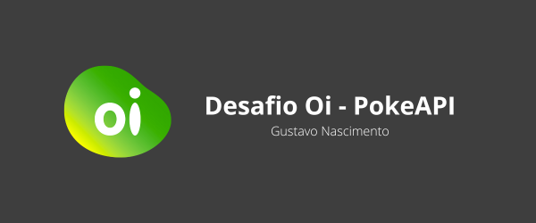

# Desafio Dev Fullstack 

Foi solicitado que fosse criado uma página web que consome o serviço PokéAPI e lista os pokémon em forma de grid, podendo ser navegado via paginação.

### Prévia do resultado final


[Link para a pagina](https://gsndev.com.br)
**Obs: Deploy realizado no Firebase em um domínio próprio.**

## Overview do desafio

### Requisitos funcionais obrigatórios

- Deverá ser exibido apenas 10 cartas por página;:white_check_mark:
- Cada carta deverá conter: Imagem do Pokemon, Nome, Tipo, Status HP, Status Ataque, Status Defesa;:white_check_mark:
- A paginação deverá estar abaixo das cartas e deverá conter 2 páginas à frente e 2 para trás, caso seja o início, colocar 4 páginas à frente e o final 4 atrás, respectivamente. Adicionar também o botóes: primeira página, última página, página anterior e próxima página;:white_check_mark: **OBS: Para manter um padrão de navegação e usabilidade foi adicionado uma condição extra, caso a página corrente seja a segunda ou a penúltima o número de páginas à direita ou à esquerda será 3.**
- A estilização deve ser feita em CSS puro ou SASS, podendo ser utilizado CSS Grid ou CSS Flexbox;:white_check_mark:

### Requisitos não funcionais obrigatórios

- Deve consumida a API REST aberta https://pokeapi.co/ (HTTP/JSON);:white_check_mark:
- Deve ser feito em React (pode utilizar Create React App);:white_check_mark:
- Deve ser gerado um README.md de como subir a aplicação;:white_check_mark:
- Implementar testes unitários (Não precisa cobrir todo o código);:white_check_mark:

### Requisitos desejáveis

- Setup de ambiente de desenvolvimento usando docker / docker- compose; :white_check_mark:
- Hospedar em um ambiente cloud a sua escolha (Heroku, AWS, IBM Cloud, GCP, etc); :white_check_mark: **OBS: Deploy realizado no firebase**
- Implementar alguma ferramenta de lint ou qualidade (sonar, code- quality, eslint, etc); :white_check_mark: **OBS: Utilizado ESLINT**
- Deploy automatizado via pipeline (gitlab-ci, github actions, etc);
<br><br>

## :hammer_and_wrench: Configuração do ambiente
### Requisitos mínimos:


### Rodando o projeto - Método tradicional
```bash
# Instalar dependências

$ npm i nstall 
# OU
$ yarn 

# Iniciando a aplicação
$ npm run start
# OU
$ yarn start
```
### Rodando o projeto - Método utilizando docker
```bash
$ npm run start:container
# OU
$ yarn start:container
```